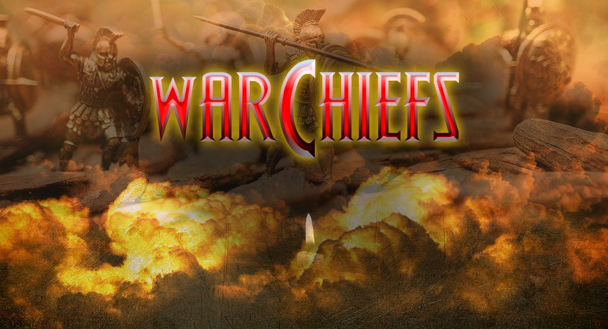
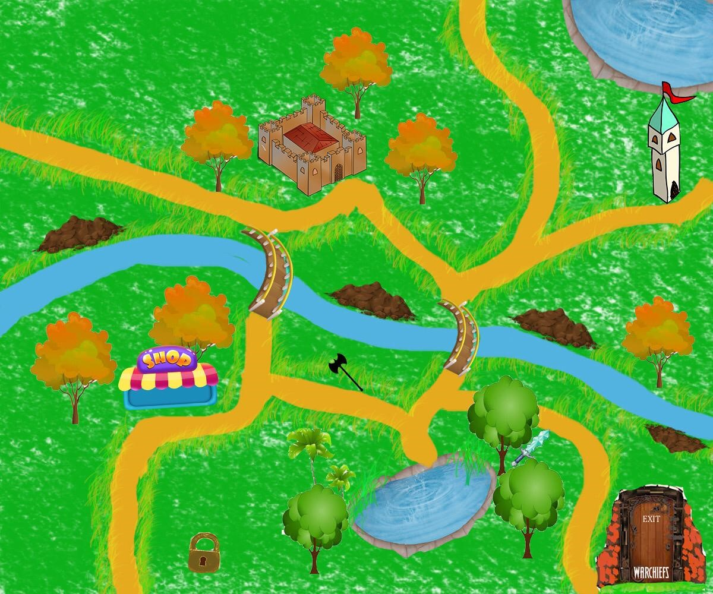
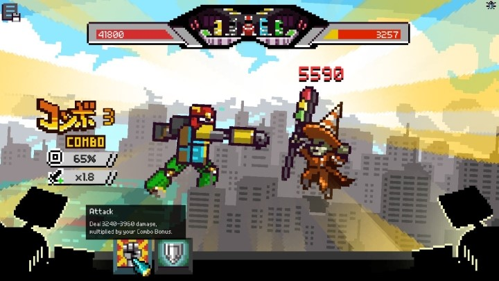
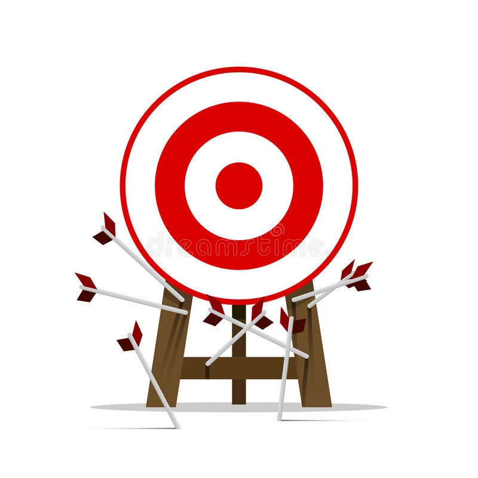
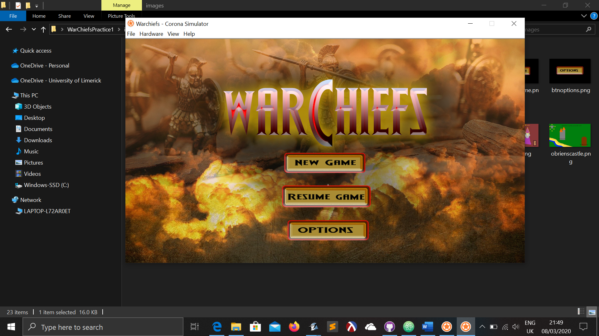
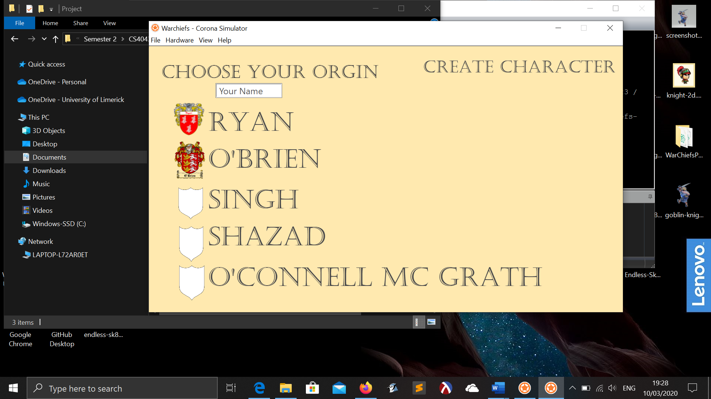
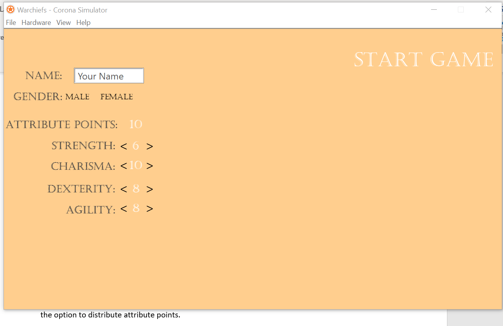

# WARCHIEFS

## Game Design Document

```
MARCH 13, 2020
GROUP 9
CS4043
```

## Contents

- Overview
- Story and Game Progression
- Game Art Design
- Game Mechanics
- System Menus
- Soundtrack and Sound Effects


## Overview

This is the game design document for Warchiefs, a role-playing game created on the Corona SDK
using LUA. The following document will detail the plans and design for the game covering:

- Story and Game Progression
- Game Art Design
- Game Mechanics
- System Menus
- Soundtrack and Sound Effects

The team is:

Jim

Oran

Harneet

Fawad

Ger


## Story and Game Progression

The game Warchiefs ( _Figure 1_ ) is set in the medieval-like era however magic is also a part of this
world. The world is controlled by different clans and they each hold a settlement. Although these
cities look unique, they contain similar buildings. These clans have been fighting each other for
hundreds of years and it is up to the player to unite them under one banner.
The game progression is outlined in the point below:

- The player character gains experience when they successfully attack a city’s castle. If
    the character gains enough experience to advance their level, they gain ability points
    which they can spend.
- The available abilities are in the form of several ability trees. It is only possible to
    unlock a later ability if the previous abilities of that tree have been unlocked.
- Furthermore, with the gold the player earns, the character can upgrade their
    weapon and buy health potions.
- When the character has conquered all the cities the game ends.

```
Figure 1 - Game Logo

```

## Game Art Design

Warchiefs will be a web-based single-player game, where we will hope to integrate RPG elements
into a beautifully built fantasy world.
All the graphics used in this game have been specifically designed using Photoshop CC 2019 and
Adobe illustrator 2019. The graphics and characters will have a very nice cartoonish touch to them.
The aim of the game is to give a whole new outlook on the RPG genre by integrating it into a
cartoonish yet harsh world.
The game will have a world map design that will be used to view all the three cities in the game. The
cities will be designed differently as the player plays separate levels in these cities. The three cities
will be designed quite beautifully, and they will include magnificent castles, towers, markets, and
maps ( _Figure 2_ ) that will be designed especially for this game.

```
Figure 2 - Original City Map
```

The player will be given a different unique design for each level which will be quite an amazing
element of this game.
This game will also have some Photoshop posters and menus!
Warchiefs is going to win the hearts of many with its unique design, engaging gameplay and Combat.


## Game Mechanics

**Player Movement:**

- Player will be able to move on world map using ASWD keys on keyboard.
    Very little physics is required one example is hit detection, this occurs when colliding with
    the city icons on the map.
- When a player enters a city, the player character disappears and buildings with clickable
    options are shown on screen.
**Combat:**
- It is a purely turned based game with no movement just the option to click buttons for
player actions such as attack and defence.
- Health bars to show damage dealt and taken by the player and his opponent (Figure 3 ).
- Players will have the option to take health potions during combat to revive their health.
There will be a limit to the capacity of a health potion to avoid players overuse to avoid
death (i.e. cheating).
- Damage dealt will pop in text box above player or enemy to make it enjoyable also giving
feedback to the player. It will enable the player to see the amount of damage inflicted with
new level/upgraded weapons.

```
Figure 3 - Example of Health Bar
```


**Player Attributes:**

- The player attributes will affect how much damage is dealt.
- The plan is that strength and dexterity attributes will increase chances of scoring a
    hit on enemy by 20% (max).
- The agility attribute will increase the level of defence.

```
Figure 4
```

**Fight Mechanics:**

- Player and enemy will start with a lower chance of scoring a hit on each other i.e.
    LvL1 range 40-60% to hit and LvL2 50- 70 %.
- We are using probability mechanics to decide whether it is a hit or not, therefore we
    plan to put an automatic hit function when the player or enemy has 3-4 misses in a
    row to keep game enjoyable. You don't want 10 misses in a row as its just unfair and
    boring.

```
Figure 5
```

## System Menus

The opening scene of the game shows a menu ( _Figure 6_ ) with three choices for the player, these can
be accessed by pressing the interactive buttons.

- The first option is for a “New Game”, which transfers the player to a new scene where a
    character can be created.
- The “Resume Game” button takes the player to the saved game screen where it is possible
    to choose from previously saved games.
- This is the “Options” button which changes to a scene with different game options available
    for the game. The player can change the sound settings and difficulty settings for the game
    here.

```
Figure 6 - Opening Menu
```

The game begins with a new menu ( _Figure 7_ ) where the player creates a character using the options
available. We have yet to finalise our number of clans, their names and crests.

```
Figure 7 - Create Character Screen
```

The next screen is the character attribute screen with a system menu ( _Figure 8_ ) to choose a name,
gender, and the option to distribute attribute points. The plan is to create male and female
characters which will appear when you make your gender choice.

```
Figure 8 - Character Attribute Screen
```


## Soundtrack and Sound Effects

As the game is set in a medieval era, that theme will be continued with the soundtrack. The game
will have multiple orchestral soundtracks for each individual city and will also have unique
soundtracks for combat sequences, the main menu, when using the market and so on. The
soundtracks will be acquired from royalty free music sites such as freemusicarchive.org.

The sound effects for the game will be original and created in-house. These sound effects will
include ambient noise, combat sound effects, environmental and enemies/NPCs. Each individual
weapon and item will have their own distinctive sound effects. There will also be sound effects
employed throughout the game’s menu systems. Full list of required sound effects for the game:

- Ambient sound
- Environmental sound effects
- Combat sound effects
- Enemies/NPCs
- Items, weapons
- Sound effects when levelling up, progressing in skill trees etc.
- Sound effects for in-game menus, main menu
There are no plans for character dialogue.


